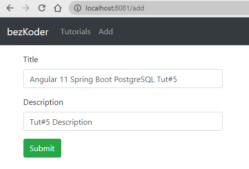
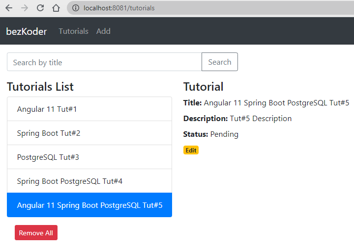
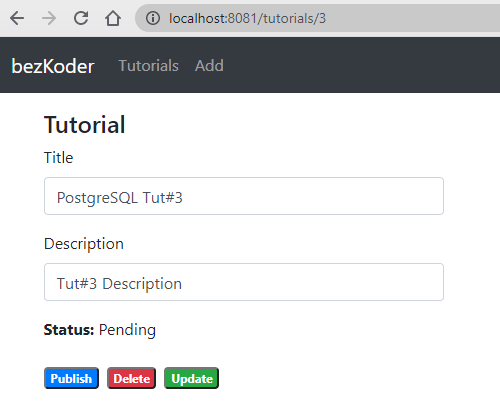
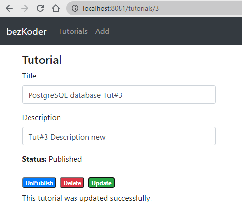
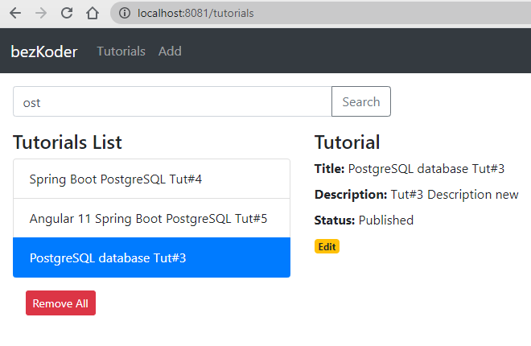
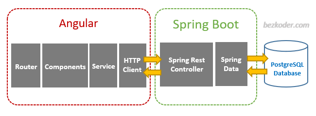

# Angular 11 + Spring Boot + PostgreSQL: Build CRUD example

For more details, please visit:
[https://bezkoder.com/angular-11-spring-boot-postgresql/](https://bezkoder.com/angular-11-spring-boot-postgresql/)

In this tutorial, we will learn how to build a full stack Angular 11 + Spring Boot + PostgreSQL example with a CRUD App. The back-end server uses Spring Boot with Spring Web MVC for REST Controller and Spring Data JPA for interacting with PostgreSQL database. Front-end side is made with Angular 11, HTTPClient & Router.

We will build a full-stack Tutorial Application in that:

- Each Tutorial has id, title, description, published status.
- We can create, retrieve, update, delete Tutorials.
- We can also find Tutorials by title.
- The images below shows screenshots of our System.

Add an object:

Retrieve all objects:

Click on **Edit** button to go to a Tutorial page:

On this Page, you can:

- change status to *Published* using **Publish** button
- delete the Tutorial using **Delete** button
- update the Tutorial details with **Update** button

Search Tutorials by title:

## Angular 11 & Spring Boot PostgreSQL CRUD Architecture
This is the application architecture we will build:

- Spring Boot exports REST Apis using Spring Web MVC & interacts with PostgreSQL Database using Spring Data JPA.
- Angular Client sends HTTP Requests and retrieve HTTP Responses using axios, shows data on the components. We also use Angular Router for navigating to pages.

